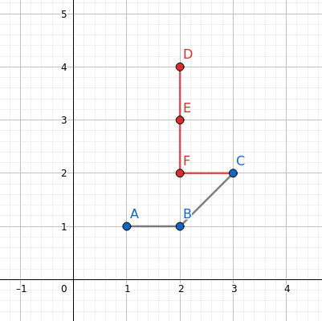

# Examples
- [Examples](#examples)
  - [Introduction](#introduction)
  - [Creating a Factory](#creating-a-factory)
    - [Cartesian Factory](#cartesian-factory)
    - [Ruby Cartesian Factory](#ruby-cartesian-factory)
    - [Spherical Factory](#spherical-factory)
    - [FFI Factory](#ffi-factory)
    - [Projected Factory](#projected-factory)
    - [3D Factory](#3d-factory)
    - [2D Factory (With M-Coordinate)](#2d-factory-with-m-coordinate)
    - [3D Factory (With M-Coordinate)](#3d-factory-with-m-coordinate)
    - [Specify an SRID](#specify-an-srid)
    - [Factory that Allows Invalid Geometries](#factory-that-allows-invalid-geometries)
  - [Points](#points)
    - [Create a Point with Coordinates](#create-a-point-with-coordinates)
    - [Create a Point with WKT](#create-a-point-with-wkt)
  - [LineStrings](#linestrings)
    - [Create a LineString with Points](#create-a-linestring-with-points)
    - [Create a LineString with WKT](#create-a-linestring-with-wkt)
    - [Get the length of a LineString](#get-the-length-of-a-linestring)
    - [Get the boundary of a LineString](#get-the-boundary-of-a-linestring)
  - [LinearRings](#linearrings)
    - [Create a LinearRing with Points](#create-a-linearring-with-points)
    - [Create a LinearRing with WKT](#create-a-linearring-with-wkt)
    - [Check if a LinearRing is valid](#check-if-a-linearring-is-valid)
  - [Polygon](#polygon)
    - [Creating a Polygon with RGeo Features](#creating-a-polygon-with-rgeo-features)
    - [Creating a Polygon with WKT](#creating-a-polygon-with-wkt)
    - [Check if a Polygon is valid](#check-if-a-polygon-is-valid)
    - [Get Points from a Polygon](#get-points-from-a-polygon)
  - [GeometryCollections](#geometrycollections)
    - [Creating a GeometryCollection with RGeo Features](#creating-a-geometrycollection-with-rgeo-features)
    - [Creating a GeometryCollection with WKT](#creating-a-geometrycollection-with-wkt)
  - [MultiPoints](#multipoints)
    - [Create a MultiPoint with RGeo Features](#create-a-multipoint-with-rgeo-features)
    - [Create a MultiPoint with WKT](#create-a-multipoint-with-wkt)
  - [MultiLineStrings](#multilinestrings)
    - [Create a MultiLineString with RGeo Features](#create-a-multilinestring-with-rgeo-features)
    - [Create a MultiLineString with WKT](#create-a-multilinestring-with-wkt)
  - [MultiPolygons](#multipolygons)
    - [Creating a MultiPolygon with RGeo Features](#creating-a-multipolygon-with-rgeo-features)
    - [Creating a MultiPolygon with WKT](#creating-a-multipolygon-with-wkt)
  - [General Methods](#general-methods)
    - [Geometry Type](#geometry-type)
    - [Check Type of Geometry (`#===`)](#check-type-of-geometry-)
    - [Bounding Box](#bounding-box)
    - [as_text](#as_text)
    - [as_binary](#as_binary)
  - [Predicates and Relationships](#predicates-and-relationships)
    - [ccw?](#ccw)
    - [is_simple?](#is_simple)
    - [is_empty?](#is_empty)
    - [contains?](#contains)
    - [crosses?](#crosses)
    - [disjoint?](#disjoint)
    - [intersects?](#intersects)
    - [overlaps?](#overlaps)
    - [touches?](#touches)
    - [within?](#within)
    - [relate?](#relate)
  - [Analysis](#analysis)
    - [Distance](#distance)
    - [Buffer](#buffer)
    - [Envelope](#envelope)
    - [ConvexHull](#convexhull)
    - [Intersection](#intersection)
    - [Union](#union)
    - [UnaryUnion](#unaryunion)
    - [Difference](#difference)
    - [SymDifference](#symdifference)

## Introduction

This guide shows examples of different operations that can be performed with RGeo. It starts with different methods for creating factories, then moves to geometry instantiation, and finally will show predicates and relationships for different geometries.

## Creating a Factory

The examples below will show different methods for creating a factory with certain properties. 

_Note that these are not exhaustive and you should refer to the docs for a complete list of options._

### Cartesian Factory

Create a 2D Cartesian factory using a GEOS integration, if available, otherwise uses a Ruby implementation.

```ruby
factory = RGeo::Cartesian.factory
p factory
#=> #<RGeo::Geos::CAPIFactory srid=0 bufres=1 flags=8> 
```

### Ruby Cartesian Factory

Create a 2D Cartesian factory using a Ruby implementation.

```ruby
factory = RGeo::Cartesian.simple_factory
p factory
#=> #<RGeo::Cartesian::Factory @has_z=false, @has_m=false, @proj4=nil, @coord_sys=nil, @srid=0, @lenient_assertions=false, @buffer_resolution=1>
```

### Spherical Factory

Create a factory that uses a spherical model of Earth when creating and analyzing geometries.

```ruby
factory = RGeo::Geographic.spherical_factory
p factory
#=> #<RGeo::Geographic::Factory @impl_prefix="Spherical", @point_class=RGeo::Geographic::SphericalPointImpl, @line_string_class=RGeo::Geographic::SphericalLineStringImpl, @linear_ring_class=RGeo::Geographic::SphericalLinearRingImpl, @line_class=RGeo::Geographic::SphericalLineImpl, @polygon_class=RGeo::Geographic::SphericalPolygonImpl, @geometry_collection_class=RGeo::Geographic::SphericalGeometryCollectionImpl, @multi_point_class=RGeo::Geographic::SphericalMultiPointImpl, @multi_line_string_class=RGeo::Geographic::SphericalMultiLineStringImpl, @multi_polygon_class=RGeo::Geographic::SphericalMultiPolygonImpl, @support_z=false, @support_m=false, @srid=4055, @proj4=nil>
```

### FFI Factory

Create a factory that specifically uses the GEOS FFI implementation, as opposed to the C Extension.

```ruby
factory = RGeo::Geos.factory(native_interface: :ffi)
p factory
#=> #<RGeo::Geos::FFIFactory srid=0>
```

### Projected Factory

Projected factories are compound factories that use a `spherical_factory` as the input and output coordinate system (lat/lons), but use a cartesian factory in a specific projected coordinate system to perform computations. A projection must be defined to convert between the two coordinate systems, which is usually done with the `rgeo-proj4` gem and `proj4` parameter, but the `simple_mercator_factory` is included with the `rgeo` gem. This uses a Mercator projection as the underlying coordinate system.

```ruby
factory = RGeo::Geographic.simple_mercator_factory
p factory
#=> #<RGeo::Geographic::Factory @impl_prefix="Projected", @point_class=RGeo::Geographic::ProjectedPointImpl, @line_string_class=RGeo::Geographic::ProjectedLineStringImpl, @linear_ring_class=RGeo::Geographic::ProjectedLinearRingImpl, @line_class=RGeo::Geographic::ProjectedLineImpl, @polygon_class=RGeo::Geographic::ProjectedPolygonImpl, @geometry_collection_class=RGeo::Geographic::ProjectedGeometryCollectionImpl, @multi_point_class=RGeo::Geographic::ProjectedMultiPointImpl, @multi_line_string_class=RGeo::Geographic::ProjectedMultiLineStringImpl, @multi_polygon_class=RGeo::Geographic::ProjectedMultiPolygonImpl, @support_z=false, @support_m=false, @srid=4326, @proj4=nil>

p factory.projection_factory
#=> #<RGeo::Geos::CAPIFactory srid=3857 bufres=1 flags=8>
```

### 3D Factory

Create a 3D Cartesian factory.

```ruby
factory = RGeo::Geos.factory(has_z_coordinate: true)
p factory
#=> #<RGeo::Geos::CAPIFactory srid=0 bufres=1 flags=10>
```

### 2D Factory (With M-Coordinate)

The M-Coordinate is used to store additional data associated with the geometry (as a `float`).

```ruby
factory = RGeo::Geos.factory(has_m_coordinate: true)
p factory
#=> #<RGeo::Geos::CAPIFactory srid=0 bufres=1 flags=12>
```

### 3D Factory (With M-Coordinate)

Create a 3D factory, with an M-coordinate.

```ruby
factory = RGeo::Geos.factory(has_z_coordinate: true, has_m_coordinate: true)
p factory
#=> #<RGeo::Geos::ZMFactory @zfactory=#<RGeo::Geos::CAPIFactory srid=0 bufres=1 flags=10>, @mfactory=#<RGeo::Geos::CAPIFactory srid=0 bufres=1 flags=12>

simple_factory = RGeo::Cartesian.simple_factory(has_z_coordinate: true, has_m_coordinate: true)
p simple_factory
#=> #<RGeo::Cartesian::Factory @has_z=true, @has_m=true, @proj4=nil, @coord_sys=nil, @srid=0, @lenient_assertions=false, @buffer_resolution=1>
```

### Specify an SRID

Create a factory with a specific Spatial Reference ID (SRID).

_Note: This does not specify how data should be converted between coordinate systems. This is essentially a tag for your data and is important if you are using a database adapter with RGeo._

```ruby
factory = RGeo::Geos.factory(srid: 3857)
p factory
#=> #<RGeo::Geos::CAPIFactory:0x2ad702f454bc srid=3857 bufres=1 flags=8>
```

### Factory that Allows Invalid Geometries

By default, most factories will not allow the creation of invalid geometries and will raise an `RGeo::Error::InvalidGeometry` exception. This can be set with the `:uses_lenient_assertions` parameter.

```ruby
factory = RGeo::Geographic.spherical_factory(uses_lenient_assertions: true)
p factory
#=> #<RGeo::Geographic::Factory:0x000055ae05d98150 @impl_prefix="Spherical", @point_class=RGeo::Geographic::SphericalPointImpl, @line_string_class=RGeo::Geographic::SphericalLineStringImpl, @linear_ring_class=RGeo::Geographic::SphericalLinearRingImpl, @line_class=RGeo::Geographic::SphericalLineImpl, @polygon_class=RGeo::Geographic::SphericalPolygonImpl, @geometry_collection_class=RGeo::Geographic::SphericalGeometryCollectionImpl, @multi_point_class=RGeo::Geographic::SphericalMultiPointImpl, @multi_line_string_class=RGeo::Geographic::SphericalMultiLineStringImpl, @multi_polygon_class=RGeo::Geographic::SphericalMultiPolygonImpl, @support_z=false, @support_m=false, @srid=4055, @proj4=nil>

p factory.property(:uses_lenient_assertions)
#=> true
```

## Points

The zero-dimensional object which all geometries are built on. Points accept floating-point numbers as arguments for x,y(,z,m).

### Create a Point with Coordinates

```ruby
factory = RGeo::Cartesian.factory
point = factory.point(1, 2)
p point
#=> #<RGeo::Geos::CAPIPointImpl "POINT (1.0 2.0)">
p point.x
#=> 1.0
p point.y
#=> 2.0

factory3D = RGeo::Cartesian.factory(has_z_coordinate: true)
point = factory3D.point(1, 2, 3)
p point.x
#=> 1.0
p point.y
#=> 2.0
p point.z
#=> 3.0

factory4D = RGeo::Cartesian.factory(has_z_coordinate: true, has_m_coordinate: true)
point = factory4D.point(1, 2, 3, 4)
p point.x
#=> 1.0
p point.y
#=> 2.0
p point.z
#=> 3.0
p point.m
#=> 4.0
```

### Create a Point with WKT

```ruby
factory = RGeo::Cartesian.factory
point = factory.parse_wkt("POINT (0.0 1.0)")
p point
#=> #<RGeo::Geos::CAPIPointImpl "POINT (0.0 1.0)">
p point.x
#=> 0.0
p point.y
#=> 1.0
```

## LineStrings

A LineString is a Curve with linear interpolation between points. Each pair of points in a LineString creates a Line.

### Create a LineString with Points

This creates a simple LineString.

```ruby
factory = RGeo::Cartesian.factory
pt1 = factory.point(0, 0)
pt2 = factory.point(2, 0)
pt3 = factory.point(2, 2)
linestring = factory.line_string([pt1, pt2, pt3])
p linestring
# => #<RGeo::Geos::CAPILineStringImpl "LINESTRING (0.0 0.0, 2.0 0.0, 2.0 2.0)"> 
```


### Create a LineString with WKT

This creates the same LineString as above.

```ruby
factory = RGeo::Cartesian.factory
linestring2 = factory.parse_wkt("LINESTRING (0 0, 2 0, 2 2)")
p linestring2
# => #<RGeo::Geos::CAPILineStringImpl "LINESTRING (0.0 0.0, 2.0 0.0, 2.0 2.0)"> 
# p linestring == linestring2
# => true
```


### Get the length of a LineString

```ruby
factory = RGeo::Cartesian.factory
linestring = factory.parse_wkt("LINESTRING (0 0, 2 0, 2 2)")
p linestring.length
# => 4.0
```

### Get the boundary of a LineString

The boundary of a LineString is the MultiPoint containing the `start_point` and `end_point` of the LineString.

```ruby
factory = RGeo::Cartesian.factory
linestring = factory.parse_wkt("LINESTRING (0 0, 2 0, 2 2)")
p linestring.boundary
#  => #<RGeo::Geos::CAPIMultiPointImpl "MULTIPOINT ((0.0 0.0), (2.0 2.0))">
```


## LinearRings

A LinearRing is a LineString that is both closed and simple. Closed means that the `start_point` and `end_point` are equivalent. Simple means that there are no self-intersections. The first example is a valid LinearRing and the second is an invalid LinearRing.


_Note: Some factories may prevent the creation of invalid LinearRings and raise an `RGeo::Error::InvalidGeometry exception._

### Create a LinearRing with Points

```ruby
factory = RGeo::Cartesian.factory
pt1 = factory.point(2, 2)
pt2 = factory.point(4, 2)
pt3 = factory.point(4, 4)
pt4 = factory.point(2, 6)
linearring = factory.linear_ring([pt1, pt2, pt3, pt4, pt1])
p linearring
# => #<RGeo::Geos::CAPILinearRingImpl "LINESTRING (2.0 2.0, 4.0 2.0, 4.0 4.0, 2.0 6.0, 2.0 2.0)"> 
p linearring.is_closed?
#=> true
p linearring.is_simple?
#=> true
```

### Create a LinearRing with WKT

Since LinearRings are just a specific case of LineStrings, they cannot be created directly with WKT, and a LineString with the same points as a LinearRing are considered equal. If you need a LinearRing type for whatever reason, this method will work to create it using WKT.

```ruby
factory = RGeo::Cartesian.factory
intermediate_linestring = factory.parse_wkt("LINESTRING (2.0 2.0, 4.0 2.0, 4.0 4.0, 2.0 6.0, 2.0 2.0)")
linearring2 = factory.linear_ring(intermediate_linestring.points)

p linearring2
# => #<RGeo::Geos::CAPILinearRingImpl "LINESTRING (2.0 2.0, 4.0 2.0, 4.0 4.0, 2.0 6.0, 2.0 2.0)">

# p linearring == linearring2
# => true

p intermediate_linestring == linearring2
# => true
```

### Check if a LinearRing is valid

```ruby
factory = RGeo::Cartesian.factory

pt1 = factory.point(2, 2)
pt2 = factory.point(4, 2)
pt3 = factory.point(4, 4)
pt4 = factory.point(2, 6)
linearring = factory.linear_ring([pt1, pt2, pt3, pt4, pt1])

linearring.valid?
# => true
```

## Polygon

A Polygon is a geometry composed of an outer ring and, optionally, multiple interior rings to form holes. All of the rings must be valid and they may not intersect each other, though they may touch at a single point.

The following are all examples of valid Polygons.


_Note in the last figure that the two interior rings share point G._

The following are examples of invalid Polygons.


### Creating a Polygon with RGeo Features

```ruby
factory = RGeo::Cartesian.factory
pt1 = factory.point(0, 0)
pt2 = factory.point(2, 0)
pt3 = factory.point(2, 2)
pt4 = factory.point(0, 2)
outerring = factory.linear_ring([pt1, pt2, pt3, pt4, pt1])
square = factory.polygon(outerring)
p square
# => #<RGeo::Geos::CAPIPolygonImpl "POLYGON ((0.0 0.0, 2.0 0.0, 2.0 2.0, 0.0 2.0, 0.0 0.0))">

pt5 = factory.point(0.5, 0.5)
pt6 = factory.point(1.5, 0.5)
pt7 = factory.point(1.5, 1.5)
pt8 = factory.point(0.5, 1.5)
interiorring = factory.linear_ring([pt5, pt6, pt7, pt8, pt5])
square_with_hole = factory.polygon(outerring, [interiorring])
p square_with_hole
#  => #<RGeo::Geos::CAPIPolygonImpl "POLYGON ((0.0 0.0, 2.0 0.0, 2.0 2.0, 0.0 2.0, 0.0 0.0), (0.5 0.5, 1.5 0.5, 1.5 1.5, 0.5 1.5, 0.5 0.5))">

p square.area
# => 4.0
p square_with_hole.area
# => 3.0
```

### Creating a Polygon with WKT

```ruby
factory = RGeo::Cartesian.factory
square_with_hole2 = factory.parse_wkt("POLYGON ((0.0 0.0, 2.0 0.0, 2.0 2.0, 0.0 2.0, 0.0 0.0), (0.5 0.5, 1.5 0.5, 1.5 1.5, 0.5 1.5, 0.5 0.5))")
p square_with_hole2
# => #<RGeo::Geos::CAPIPolygonImpl "POLYGON ((0.0 0.0, 2.0 0.0, 2.0 2.0, 0.0 2.0, 0.0 0.0), (0.5 0.5, 1.5 0.5, 1.5 1.5, 0.5 1.5, 0.5 0.5))">
# p square_with_hole2 == square_with_hole
# => true
```

### Check if a Polygon is valid

```ruby
factory = RGeo::Cartesian.factory
pt1 = factory.point(0, 0)
pt2 = factory.point(2, 0)
pt3 = factory.point(2, 2)
pt4 = factory.point(0, 2)
outerring = factory.linear_ring([pt1, pt2, pt3, pt4, pt1])
square = factory.polygon(outerring)


pt5 = factory.point(0.5, 0.5)
pt6 = factory.point(1.5, 0.5)
pt7 = factory.point(1.5, 1.5)
pt8 = factory.point(0.5, 1.5)
interiorring = factory.linear_ring([pt5, pt6, pt7, pt8, pt5])
square_with_hole = factory.polygon(outerring, [interiorring])

square_with_hole.valid?
# => true
```

### Get Points from a Polygon

It is a common operation to get the points that make up a Polygon directly. Since a Polygon is made up of an exterior ring and multiple interior rings, the points from these need to be extracted separately.

```ruby
factory = RGeo::Cartesian.factory
pt1 = factory.point(0, 0)
pt2 = factory.point(2, 0)
pt3 = factory.point(2, 2)
pt4 = factory.point(0, 2)
outerring = factory.linear_ring([pt1, pt2, pt3, pt4, pt1])
square = factory.polygon(outerring)

pt5 = factory.point(0.5, 0.5)
pt6 = factory.point(1.5, 0.5)
pt7 = factory.point(1.5, 1.5)
pt8 = factory.point(0.5, 1.5)
interiorring = factory.linear_ring([pt5, pt6, pt7, pt8, pt5])
square_with_hole = factory.polygon(outerring, [interiorring])

exterior = square_with_hole.exterior_ring
p exterior
# => #<RGeo::Geos::CAPILinearRingImpl "LINESTRING (0.0 0.0, 2.0 0.0, 2.0 2.0, 0.0 2.0, 0.0 0.0)">
p exterior.points
# => [#<RGeo::Geos::CAPIPointImpl "POINT (0.0 0.0)">, #<RGeo::Geos::CAPIPointImpl "POINT (2.0 0.0)">, #<RGeo::Geos::CAPIPointImpl "POINT (2.0 2.0)">, #<RGeo::Geos::CAPIPointImpl "POINT (0.0 2.0)">, #<RGeo::Geos::CAPIPointImpl "POINT (0.0 0.0)">]

interior_rings = square_with_hole.interior_rings
p interior_rings
# => [#<RGeo::Geos::CAPILinearRingImpl "LINESTRING (0.5 0.5, 1.5 0.5, 1.5 1.5, 0.5 1.5, 0.5 0.5)">]

# get array of point arrays
interior_points = interior_rings.map(&:points)
p interior_points
# => [[#<RGeo::Geos::CAPIPointImpl "POINT (0.5 0.5)">, #<RGeo::Geos::CAPIPointImpl "POINT (1.5 0.5)">, #<RGeo::Geos::CAPIPointImpl "POINT (1.5 1.5)">, #<RGeo::Geos::CAPIPointImpl "POINT (0.5 1.5)">, #<RGeo::Geos::CAPIPointImpl "POINT (0.5 0.5)">]]
```

## GeometryCollections

The following types are GeometryCollections.

A GeometryCollection is a geometric object this is a collection of one or more geometric objects. All the elements in a GeometryCollection shall be in the same Spatial Reference. This is also the Spatial Reference for the GeometryCollection.

A generic GeometryCollection places no other constraints what can be contained in the collection, but this limits the types of operations that can be performed on a GeometryCollection. For this reason, you should always prefer MultiPoint, MultiLineString, and MultiPolygon to GeometryCollection when possible.

### Creating a GeometryCollection with RGeo Features

```ruby
factory = RGeo::Cartesian.factory

pt1 = factory.point(0, 0)
pt2 = factory.point(1, 0)
pt3 = factory.point(1, 1)
linestring = factory.line_string([pt1, pt2, pt3])
collection = factory.collection([pt1, pt2, pt3, linestring])
p collection
# => #<RGeo::Geos::CAPIGeometryCollectionImpl "GEOMETRYCOLLECTION (POINT (0.0 0.0), POINT (1.0 0.0), POINT (1.0 1.0), LINESTRING (0.0 0.0, 1.0 0.0, 1.0 1.0))">

collection.each do |geom|
  p geom
end
# => #<RGeo::Geos::CAPIPointImpl:0x348 "POINT (0.0 0.0)">
# => #<RGeo::Geos::CAPIPointImpl:0x35c "POINT (1.0 0.0)">
# => #<RGeo::Geos::CAPIPointImpl:0x370 "POINT (1.0 1.0)">
# => #<RGeo::Geos::CAPILineStringImpl:0x384 "LINESTRING (0.0 0.0, 1.0 0.0, 1.0 1.0)">
```

### Creating a GeometryCollection with WKT

```ruby
factory = RGeo::Cartesian.factory

collection2 = factory.parse_wkt("GEOMETRYCOLLECTION (POINT (0.0 0.0), POINT (1.0 0.0), POINT (1.0 1.0), LINESTRING (0.0 0.0, 1.0 0.0, 1.0 1.0))")
p collection2
# => #<RGeo::Geos::CAPIGeometryCollectionImpl "GEOMETRYCOLLECTION (POINT (0.0 0.0), POINT (1.0 0.0), POINT (1.0 1.0), LINESTRING (0.0 0.0, 1.0 0.0, 1.0 1.0))">
# p collection == collection2
# => true
```

## MultiPoints

A MultiPoint is a collection of Point objects. A MultiPoint is simple if no two points are equal. The boundary is the empty set.

### Create a MultiPoint with RGeo Features

```ruby
factory = RGeo::Cartesian.factory

pt1 = factory.point(0, 0)
pt2 = factory.point(1, 1)
multipoint = factory.multi_point([pt1, pt2])
p multipoint
# => #<RGeo::Geos::CAPIMultiPointImpl "MULTIPOINT ((0.0 0.0), (1.0 1.0))">
```

### Create a MultiPoint with WKT

```ruby
factory = RGeo::Cartesian.factory

multipoint2 = factory.parse_wkt("MULTIPOINT ((0.0 0.0), (1.0 1.0))")
p multipoint2
# => #<RGeo::Geos::CAPIMultiPointImpl "MULTIPOINT ((0.0 0.0), (1.0 1.0))">

# p multipoint == multipoint2
# => true
```

## MultiLineStrings

A MultiLineString is a collection of LineString objects. A MultiLineString is simple if and only if all of its elements are simple and the only intersections betwen any two elements occur at Points that are on the boundaries (`start_point` or `end_point`) of both elements.

A MultiLineString is closed if all of its elements are closed.

The following is an example of a simple MultiLineString.



The following are examples of non-simple MultiLineStrings.


### Create a MultiLineString with RGeo Features

```ruby
factory = RGeo::Cartesian.factory

pt1 = factory.point(2, 4)
pt2 = factory.point(2, 3)
pt3 = factory.point(2, 2)
pt4 = factory.point(3, 2)
pt5 = factory.point(2, 1)
pt6 = factory.point(1, 1)
linestring1 = factory.line_string([pt1, pt2, pt3, pt4])
linestring2 = factory.line_string([pt4, pt5, pt6])
multi_linestring = factory.multi_line_string([linestring1, linestring2])
p multi_linestring
# => #<RGeo::Geos::CAPIMultiLineStringImpl "MULTILINESTRING ((2.0 4.0, 2.0 3.0, 2.0 2.0, 3.0 2.0), (3.0 2.0, 2.0 1.0, 1.0 1.0))">

p multi_linestring.length
# => 5.414213562373095
p multi_linestring.boundary
# => #<RGeo::Geos::CAPIMultiPointImpl "MULTIPOINT ((1.0 1.0), (2.0 4.0))">
```

### Create a MultiLineString with WKT

```ruby
factory = RGeo::Cartesian.factory

multi_linestring2 = factory.parse_wkt("MULTILINESTRING ((2.0 4.0, 2.0 3.0, 2.0 2.0, 3.0 2.0), (3.0 2.0, 2.0 1.0, 1.0 1.0))")
p multi_linestring2
# => #<RGeo::Geos::CAPIMultiLineStringImpl "MULTILINESTRING ((2.0 4.0, 2.0 3.0, 2.0 2.0, 3.0 2.0), (3.0 2.0, 2.0 1.0, 1.0 1.0))">
# p multi_linestring == multi_linestring2
# => true
```

## MultiPolygons

A MultiPolygon is a collection of Polygons. A MultiPolygon is simple if all Polygons are simple, the Polygons do not cross, and the MultiPolygon is topologically closed.

The following are examples of simple MultiPolygons.


The following are examples of non-simple MultiPolygons.


### Creating a MultiPolygon with RGeo Features

```ruby
factory = RGeo::Cartesian.factory

pt1 = factory.point(0, 0)
pt2 = factory.point(2, 0)
pt3 = factory.point(2, 2)
pt4 = factory.point(0, 2)

pt5 = factory.point(0.5, 0.5)
pt6 = factory.point(1.5, 0.5)
pt7 = factory.point(1.5, 1.5)
pt8 = factory.point(0.5, 1.5)

pt9 = factory.point(3, 3)
pt10 = factory.point(4, 3)
pt11 = factory.point(4, 4)
pt12 = factory.point(3, 4)

outerring1 = factory.linear_ring([pt1, pt2, pt3, pt4, pt1])
innerring = factory.linear_ring([pt5, pt6, pt7, pt8, pt5])

square_with_hole = factory.polygon(outerring1, [innerring])

outerring2 = factory.linear_ring([pt9, pt10, pt11, pt12])
square = factory.polygon(outerring2)

multipolygon = factory.multi_polygon([square_with_hole, square])
p multipolygon
# => #<RGeo::Geos::CAPIMultiPolygonImpl "MULTIPOLYGON (((0.0 0.0, 2.0 0.0, 2.0 2.0, 0.0 2.0, 0.0 0.0), (0.5 0.5, 1.5 0.5, 1.5 1.5, 0.5 1.5, 0.5 0.5)), ((3.0 3.0, 4.0 3.0, 4.0 4.0, 3.0 4.0, 3.0 3.0)))">
```

This creates the following MultiPolygon.


### Creating a MultiPolygon with WKT

```ruby
factory = RGeo::Cartesian.factory

multipolygon2 = factory.parse_wkt("MULTIPOLYGON (((0.0 0.0, 2.0 0.0, 2.0 2.0, 0.0 2.0, 0.0 0.0), (0.5 0.5, 1.5 0.5, 1.5 1.5, 0.5 1.5, 0.5 0.5)), ((3.0 3.0, 4.0 3.0, 4.0 4.0, 3.0 4.0, 3.0 3.0)))")

p multipolygon2
# => #<RGeo::Geos::CAPIMultiPolygonImpl "MULTIPOLYGON (((0.0 0.0, 2.0 0.0, 2.0 2.0, 0.0 2.0, 0.0 0.0), (0.5 0.5, 1.5 0.5, 1.5 1.5, 0.5 1.5, 0.5 0.5)), ((3.0 3.0, 4.0 3.0, 4.0 4.0, 3.0 4.0, 3.0 3.0)))">

# p multipolygon == multipolygon2
# => true
```

## General Methods

### Geometry Type

All RGeo Features will return their geometry type.

```ruby
factory = RGeo::Cartesian.factory
p factory.parse_wkt("POINT (0 0)").geometry_type
# => RGeo::Feature::Point
```

### Check Type of Geometry (`#===`)

The case equality operator can be used to check the type of an RGeo Feature.

```ruby
factory = RGeo::Cartesian.factory
pt = factory.point(0, 0)
linestring = factory.line_string([pt, factory.point(0, 1)])

p RGeo::Feature::Point.check_type(pt)
# => true
p RGeo::Feature::Point.check_type(linestring)
# => false

def is_point?(feature)
  case feature
  when RGeo::Feature::Point
    p "It's a Point!"
    true
  else
    p "It's not a Point"
    false
  end
end

is_point?(pt)
# => "It's a Point!"

is_point?(linestring)
# => "It's not a Point"
```

### Bounding Box

RGeo has a special object for BoundingBoxes: `RGeo:: Cartesian::BoundingBox`. BoundingBoxes can be created from a geometry or two corner Points.

```ruby
factory = RGeo::Cartesian.factory

pt1 = factory.point(0, 0)
pt2 = factory.point(1, 1)
p RGeo::Cartesian::BoundingBox.create_from_points(pt1, pt2)
# => #<RGeo::Cartesian::BoundingBox @factory=#<RGeo::Geos::CAPIFactory srid=0 bufres=1 flags=8>, @has_z=false, @has_m=false, @max_m=nil, @min_m=nil, @max_z=nil, @min_z=nil, @max_y=1.0, @min_y=0.0, @max_x=1.0, @min_x=0.0>

polygon = factory.parse_wkt("POLYGON ((0 0, 0 3, 3 3, 3 0, 0 0))")
p RGeo::Cartesian::BoundingBox.create_from_geometry(polygon)
# => #<RGeo::Cartesian::BoundingBox @factory=#<RGeo::Geos::CAPIFactory srid=0 bufres=1 flags=8>, @has_z=false, @has_m=false, @max_m=nil, @min_m=nil, @max_z=nil, @min_z=nil, @max_y=3.0, @min_y=0.0, @max_x=3.0, @min_x=0.0>
```

### as_text

Get the WKT representation of a geometry.

```ruby
factory = RGeo::Cartesian.factory
p factory.point(1, 1).as_text
# => "POINT (1.0 1.0)" 
```

### as_binary

Get the WKB representation of a geometry.

```ruby
factory = RGeo::Cartesian.factory
p factory.point(1, 1).as_binary
# => "\x00\x00\x00\x00\x01?\xF0\x00\x00\x00\x00\x00\x00?\xF0\x00\x00\x00\x00\x00\x00" 
```

## Predicates and Relationships

There are two types of predicates, unary and binary. Unary predicates are implemented as boolean attributes for an object, while binary predicates return a boolean after doing some comparison between two objects.

The following are unary predicates.

### ccw?

`#ccw?` is implemented on LinearRings and returns true if the Points that form the LinearRing are ordered in a counter-clockwise fashion.

_Note: You need to use LinearRings for `ccw?` LineStrings will not work._

```ruby
factory = RGeo::Cartesian.factory
pt1 = factory.point(0, 0)
pt2 = factory.point(1, 0)
pt3 = factory.point(1, 1)
pt4 = factory.point(0, 1)

p factory.linear_ring([pt1, pt2, pt3, pt4, pt1]).ccw?
# => true
```

### is_simple?

```ruby
factory = RGeo::Cartesian.factory

pt1 = factory.point(0, 0)
pt2 = factory.point(1, 0)
pt3 = factory.point(1, 1)
pt4 = factory.point(0, 1)

p factory.linear_ring([pt1, pt2, pt3, pt4, pt1]).is_simple?
# => true
```

### is_empty?

Returns `true` if the object is the empty set.

```ruby
factory = RGeo::Cartesian.factory

pt1 = factory.point(0, 0)
pt2 = factory.point(1, 0)
pt3 = factory.point(1, 1)
pt4 = factory.point(0, 1)

p factory.linear_ring([pt1, pt2, pt3, pt4, pt1]).is_empty?
# => false

p factory.multi_point([]).is_empty?
# => true
```

The following are binary predicates.

### contains?

Returns `true` if the caller contains the other geometry.

```ruby
factory = RGeo::Cartesian.factory

polygon = factory.parse_wkt("POLYGON ((0 0, 0 1, 1 1, 1 0, 0 0))")
pt1 = factory.point(0.5, 0.5)
p polygon.contains?(pt1)
# => true

pt2 = factory.point(2, 2)
p polygon.contains?(pt2)
# => false

# this also works for other object types
linestring = factory.line_string([pt1, factory.point(0.75, 0.75)])
p polygon.contains?(linestring)
# => true
```

### crosses?

Returns `true` if the caller spatially crosses the other geometry

```ruby
factory = RGeo::Cartesian.factory

other_geom = factory.parse_wkt("POLYGON ((0 0, 0 1, 1 1, 1 0, 0 0))")
pt1 = factory.point(0.5, 0.5)
pt2 = factory.point(0.75, 0.75)
pt3 = factory.point(1.5, 1.5)

linestring1 = factory.line_string([pt1, pt2])
p linestring1.crosses?(other_geom)
# => false

linestring2 = factory.line_string([pt1, pt2, pt3])
p linestring2.crosses?(other_geom)
# => true
```

### disjoint?

Returns `true` if the caller and the other geometry are spatially disjoint. This means that the two geometries do not overlap, touch, or contain each other.

```ruby
factory = RGeo::Cartesian.factory

polygon = factory.parse_wkt("POLYGON ((0 0, 0 1, 1 1, 1 0, 0 0))")
pt1 = factory.point(0.5, 0.5)
p polygon.disjoint?(pt1)
# => false

pt2 = factory.point(2, 2)
p polygon.disjoint?(pt2)
# => true

# this also works for other object types
linestring = factory.line_string([pt1, factory.point(0.75, 0.75)])
p polygon.disjoint?(linestring)
# => false
```

### intersects?

Return `true` if the caller and the other geometry spatially intersect. This means that the two geometries overlap, touch, or contain one another. This is the opposite of `disjoint?`.

```ruby
factory = RGeo::Cartesian.factory

polygon = factory.parse_wkt("POLYGON ((0 0, 0 1, 1 1, 1 0, 0 0))")
pt1 = factory.point(0.5, 0.5)
p polygon.intersects?(pt1)
# => true

pt2 = factory.point(2, 2)
p polygon.intersects?(pt2)
# => false

# this also works for other object types
linestring = factory.line_string([pt1, factory.point(0.75, 0.75)])
p polygon.intersects?(linestring)
# => true
```

### overlaps?

Return `true` if the caller overlaps the other geometry. Two geometries overlap if they intersect but one does not completely contain another.

```ruby
factory = RGeo::Cartesian.factory

pt1 = factory.point(0, 0)
pt2 = factory.point(1, 1)
pt3 = factory.point(2, 1)
pt4 = factory.point(3, 0)

pt5 = factory.point(0, 2)
pt6 = factory.point(3, 2)

linestring1 = factory.line_string([pt1, pt2, pt3, pt4])
linestring2 = factory.line_string([pt5, pt2, pt3, pt6])

p linestring1.overlaps?(linestring2)
# => true
```

### touches?

Return `true` if the only points in common between the caller and the other geometry lie in the union of the boundaries of both.

```ruby
factory = RGeo::Cartesian.factory

linestring = factory.parse_wkt("LINESTRING (0 0, 1 1, 0 2)")
pt1 = factory.point(1, 1)
pt2 = factory.point(0, 2)

# they do not touch since pt1 is not on the boundary of linestring
p linestring.touches?(pt1)
# => false

p linestring.touches?(pt2)
# => true
```

### within?

Return `true` if the caller is completely inside the other geometry.

```ruby
factory = RGeo::Cartesian.factory

pt = factory.point(1, 1)
polygon = factory.parse_wkt("POLYGON ((0 0, 0 2, 2 2, 2 0, 0 0))")
p pt.within?(polygon)
# => true
```

### relate?

Return `true` if the caller and the other geometry are related by the given [DE-9IM](http://en.wikipedia.org/wiki/DE-9IM). The DE-9IM is specified as a 9-element matrix indicating the dimension of the intersections between the Interior, Boundary, and Exterior of two geometries. It is represented by a 9-character text string using the symbols 'F', '0', '1', '2', 'T', '*'.

```ruby
factory = RGeo::Cartesian.factory

# contains relationship
intersection_matrix = 'T*****FF*'
pt = factory.point(1, 1)
polygon = factory.parse_wkt("POLYGON ((0 0, 0 2, 2 2, 2 0, 0 0))")
p polygon.relate?(pt, intersection_matrix)
# => true
```

## Analysis

These methods return geometries or numerics and may require another geometry as input.

### Distance

Get the shortest distance between any two Points in the two geometric objects as calculated in the spatial reference system of the geometric object.

```ruby
factory = RGeo::Cartesian.factory

# distance between two Points
pt1 = factory.point(0, 0)
pt2 = factory.point(0, 2)

p pt2.distance(pt1)
# => 2.0

# find distance between LineString on y-axis and a Point at 1,1
linestring = factory.line_string([pt1, pt2])
pt3 = factory.point(1, 1)

pt3.distance(linestring)
# => 1.0
```

### Buffer

Returns a geometry that represents all points whose distance from the caller is less than or equal to the distance passed into the method. The shape of the buffer is dependent on the `buffer_resolution` property of the factory. The default value is 1 which will create a 4-sided polygon, 2 will create an 8-sided polygon, 3 will create a 12-sided polygon, and continue this pattern as `buffer_resolution` increases.

```ruby
factory = RGeo::Cartesian.factory

pt = factory.point(0, 0)
square = pt.buffer(10)

p square
# => #<RGeo::Geos::CAPIPolygonImpl "POLYGON ((10.0 0.0, 1.6155445744325867E-14 -10.0, -10.0 -3.2310891488651735E-14, -4.624589118372729E-14 10.0, 10.0 0.0))">

factory2 = RGeo::Cartesian.factory(buffer_resolution: 3)
pt = factory2.point(0, 0)
buffer = pt.buffer(10)

p buffer
# => #<RGeo::Geos::CAPIPolygonImpl:0x2ae73aecce5c "POLYGON ((10.0 0.0, 8.660254037844389 -4.999999999999996, 5.000000000000009 -8.660254037844382, 1.3934999695075554E-14 -10.0, -4.999999999999983 -8.660254037844396, -8.660254037844373 -5.000000000000022, -10.0 -3.2310891488651735E-14, -8.660254037844407 4.999999999999966, -5.000000000000035 8.660254037844366, -4.624589118372729E-14 10.0, 4.999999999999955 8.660254037844412, 8.660254037844357 5.0000000000000515, 10.0 0.0))">
```

### Envelope

Returns the minimum bounding box for the geometry as a Polygon. The polygon is defined by the corner points of the bounding box [(MINX, MINY), (MAXX, MINY), (MAXX, MAXY), (MINX, MAXY), (MINX, MINY)].

```ruby
factory = RGeo::Cartesian.factory

linestring = factory.line_string([factory.point(0, 0), factory.point(1, 3)])
envelope = linestring.envelope

p envelope
# => #<RGeo::Geos::CAPIPolygonImpl "POLYGON ((0.0 0.0, 1.0 0.0, 1.0 3.0, 0.0 3.0, 0.0 0.0))">
```

### ConvexHull

Returns the convex hull of a geometry. The convex hull is the smallest convex geometry that encloses all geometries of the caller. The convex hull is usually a Polygon, but in some cases, it can be a LineString or a Point.

```ruby
factory = RGeo::Cartesian.factory

pt1 = factory.point(0, 0)
pt2 = factory.point(1, 1)
pt3 = factory.point(1, -1)
multipoint = factory.multi_point([pt1, pt2, pt3])
c_hull = multipoint.convex_hull

p c_hull
# => #<RGeo::Geos::CAPIPolygonImpl "POLYGON ((1.0 -1.0, 0.0 0.0, 1.0 1.0, 1.0 -1.0))">
```

### Intersection

Returns the intersection of the caller and the other geometry. The intersection is the portion of the caller and the other geometry that is shared between the two. If the geometries are disjoint, then an empty geometry collection is returned.

```ruby
factory = RGeo::Cartesian.factory

square1 = factory.parse_wkt("POLYGON ((0 0, 0 2, 2 2, 2 0, 0 0))")
square2 = factory.parse_wkt("POLYGON ((1 0, 1 2, 3 2, 3 0, 1 0))")
intersection = square1.intersection(square2)

p intersection
# => #<RGeo::Geos::CAPIPolygonImpl "POLYGON ((1.0 2.0, 2.0 2.0, 2.0 0.0, 1.0 0.0, 1.0 2.0))"> 
```

### Union

Merges the input geometries to produce a result with no overlaps.

```ruby
factory = RGeo::Cartesian.factory

square1 = factory.parse_wkt("POLYGON ((0 0, 0 2, 2 2, 2 0, 0 0))")
square2 = factory.parse_wkt("POLYGON ((1 0, 1 2, 3 2, 3 0, 1 0))")
union = square1.union(square2)

p union
# => #<RGeo::Geos::CAPIPolygonImpl "POLYGON ((0.0 0.0, 0.0 2.0, 1.0 2.0, 2.0 2.0, 3.0 2.0, 3.0 0.0, 2.0 0.0, 1.0 0.0, 0.0 0.0))">
```

### UnaryUnion

Creates a union from a GeometryCollection. If using GEOS this will be faster than calling union on many geometries, so prefer this.

```ruby
factory = RGeo::Cartesian.factory

square1 = factory.parse_wkt("POLYGON ((0 0, 0 2, 2 2, 2 0, 0 0))")
square2 = factory.parse_wkt("POLYGON ((1 0, 1 2, 3 2, 3 0, 1 0))")
squares = factory.collection([square1, square2])
union = squares.unary_union

p union
# => #<RGeo::Geos::CAPIPolygonImpl "POLYGON ((0.0 0.0, 0.0 2.0, 1.0 2.0, 2.0 2.0, 3.0 2.0, 3.0 0.0, 2.0 0.0, 1.0 0.0, 0.0 0.0))"> 
```

### Difference

Returns a geometry representing the part of the caller that does not intersect the other geometry.

```ruby
factory = RGeo::Cartesian.factory

square1 = factory.parse_wkt("POLYGON ((0 0, 0 2, 2 2, 2 0, 0 0))")
square2 = factory.parse_wkt("POLYGON ((1 0, 1 2, 3 2, 3 0, 1 0))")
diff = square1.difference(square2)

p diff
# => #<RGeo::Geos::CAPIPolygonImpl "POLYGON ((0.0 0.0, 0.0 2.0, 1.0 2.0, 1.0 0.0, 0.0 0.0))"> 
```

### SymDifference

Returns a geometry representing the portions of the caller and the other geometry that do not intersect. This is the same as `geom.union(oth) - geom.intersection(oth)`.

```ruby
factory = RGeo::Cartesian.factory

square1 = factory.parse_wkt("POLYGON ((0 0, 0 2, 2 2, 2 0, 0 0))")
square2 = factory.parse_wkt("POLYGON ((1 0, 1 2, 3 2, 3 0, 1 0))")
sdiff = square1.sym_difference(square2)

p sdiff
# => #<RGeo::Geos::CAPIMultiPolygonImpl "MULTIPOLYGON (((0.0 0.0, 0.0 2.0, 1.0 2.0, 1.0 0.0, 0.0 0.0)), ((2.0 0.0, 2.0 2.0, 3.0 2.0, 3.0 0.0, 2.0 0.0)))">
```